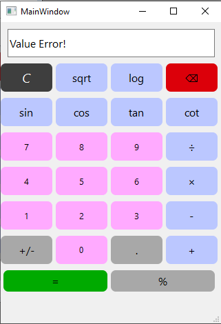
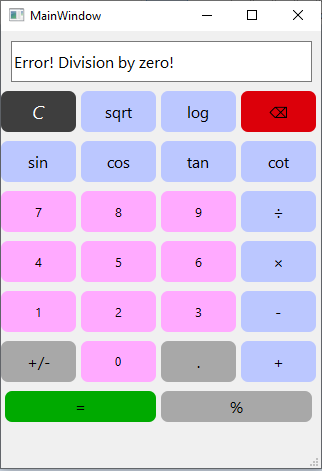
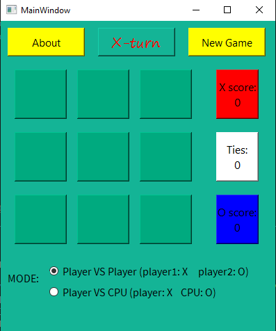
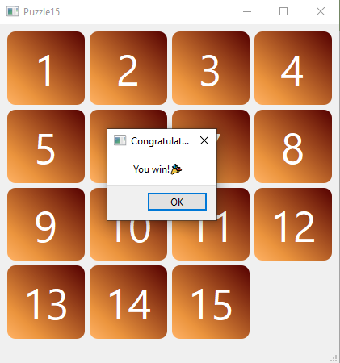

# Qt-Program

---------------------

## Calculator app 🧮
______

- language: Python

### The main window

### If an error occurs

- For example: cot 0

- Or division by zero

------------

## TicTocToe- Game ❌⭕
------
- language: Python

- pictures:

----------

## Puzzle15

- language: Python
- pictures:

